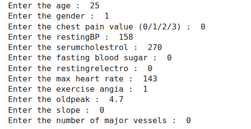
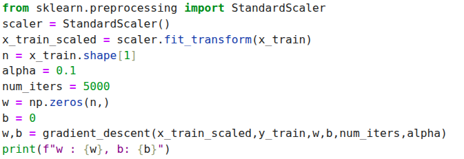
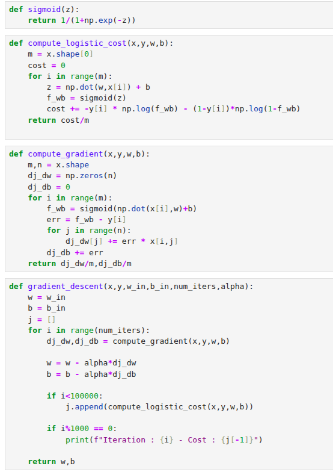
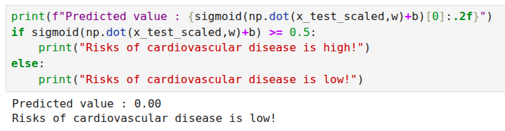

# ❤️ Cardio Disease Prediction Model

This project implements a **Logistic Regression model** from scratch to predict the risk of cardiovascular disease based on health attributes like age, blood pressure, cholesterol levels, and more.

No fancy ML libraries were used to train the model — it’s all **NumPy-powered logic** with manually implemented cost functions and gradient descent.


## 🚀 Use Case

This model helps predict the **likelihood of cardiovascular disease** using multiple health factors. Real-world applications include:

- 🏥 **Hospitals & Clinics**: Early identification of high-risk patients for timely intervention.  
- 💉 **Healthcare Providers**: Design preventive care programs based on patient risk profiles.  
- 📊 **Data Analysts & Researchers**: Analyze trends in cardiovascular risk factors.  
- 🧑‍⚕️ **Public Health Officials**: Allocate resources efficiently to vulnerable populations.

> With this model, stakeholders get an actionable tool to reduce cardiovascular incidents through early detection.


## 📊 Dataset

The dataset contains various cardiovascular health parameters including:

- `age`  
- `gender`  
- `height`, `weight`  
- `systolic` and `diastolic blood pressure`  
- `cholesterol` levels  
- `glucose` levels  
- `smoking` and `alcohol` habits  
- `physical activity`  
- `cardiovascular disease` label (target variable)


## 🚀 Features

- ✅ Data scaling with `StandardScaler`  
- ✅ Logistic Regression implemented from scratch with gradient descent  
- ✅ Binary classification with sigmoid activation  
- ✅ Model evaluation via **accuracy score**  


## 🎯 Demo

Here’s how the model works end-to-end:


## **Input** : User provides the following details:
- `age`  
- `gender`  
- `height`, `weight`  
- `systolic` and `diastolic blood pressure`  
- `cholesterol` levels  
- `glucose` levels  
- `smoking` and `alcohol` habits  
- `physical activity`  
- `cardiovascular disease` label (target variable)




## **Preprocessing**:
   - All features are scaled using StandardScaler.

   - Final data is shaped to match training input format.




## **Model Training**:
   - A custom implementation of **Logistic Regression** using **Gradient Descent**.
   - The model learns to minimize the cost over iterations. Finally it returns the values of w and b when the cost reaches the global minimum




## **Output**:
   - The model outputs a **probability score** for cardiovascular disease .
   - A threshold(can be changed to increase accuracy) is applied:
    
    If predicted probability ≥ 0.4 → Classified as 'High Risk'
    If predicted probability < 0.4 → Classified as 'Low Risk'
    



## Accuracy
```text
Training Accuracy: ~97% 

Custom implementation accuracy may vary based on iterations and learning rate
```


## How the Data Was Used

The dataset and its documentation were used for:
- Data preprocessing (variable selection, code interpretation)
- Model training and evaluation

## Attribute Overview

| Attribute                       | Code              | Unit              | Type     | Description                                                                                      |
|----------------------------------|-------------------|-------------------|----------|--------------------------------------------------------------------------------------------------|
| Patient Identification Number    | patientid         | Number            | Numeric  | Unique patient identifier                                                                        |
| Age                             | age               | In Years          | Numeric  | Patient age                                                                                      |
| Gender                          | gender            | 0=female, 1=male  | Binary   | Gender of the patient                                                                            |
| Chest pain type                  | chestpain         | 0,1,2,3           | Nominal  | 0: typical angina, 1: atypical angina, 2: non-anginal pain, 3: asymptomatic                     |
| Resting blood pressure           | restingBP         | mm Hg             | Numeric  | Resting blood pressure                                                                           |
| Serum cholesterol                | serumcholestrol   | mg/dl             | Numeric  | Serum cholesterol level                                                                          |
| Fasting blood sugar              | fastingbloodsugar | 0,1 (>120 mg/dl)  | Binary   | 0 = false, 1 = true                                                                             |
| Resting electrocardiogram result | restingrelectro   | 0,1,2             | Nominal  | 0: normal, 1: ST-T abnormality, 2: left ventricular hypertrophy                                  |
| Maximum heart rate achieved      | maxheartrate      | Number            | Numeric  | Maximum heart rate achieved                                                                      |
| Exercise induced angina          | exerciseangia     | 0,1               | Binary   | 0 = no, 1 = yes                                                                                 |
| Oldpeak = ST depression          | oldpeak           | 0-6.2             | Numeric  | ST depression induced by exercise relative to rest                                               |
| Slope of peak exercise ST segment| slope             | 1,2,3             | Nominal  | 1: upsloping, 2: flat, 3: downsloping                                                           |
| Number of major vessels          | noofmajorvessels  | 0,1,2,3           | Numeric  | Number of major vessels colored by fluoroscopy                                                   |
| Classification (target)          | target            | 0,1               | Binary   | 0 = Absence of Heart Disease, 1 = Presence of Heart Disease                                      |


## Data Sources

This project uses the "Cardiovascular Disease Dataset" and its official documentation:

- **Website Link :** [`Mendeley Data`](https://data.mendeley.com/datasets/dzz48mvjht/1)
- **Dataset :** [`Cardiovascular_Disease_Dataset.csv`](Cardiovascular_Disease_Dataset.csv)
- **Documentation :** [`Cardiovascular_Disease_Dataset_Description.pdf`](Cardiovascular_Disease_Dataset_Description.pdf)

All variable definitions, codes, and units were referenced from the documentation PDF.

## 🛠️ Installation

```bash
git clone https://github.com/a-anuj/cardio-disease-prediction.git
cd cardio-disease-prediction
pip install numpy pandas scikit-learn matplotlib
```
## 📈 Run the Model
```bash
python3 model.py

# Or run all cells in cardiovascular-disease-predictor.ipynb
```


